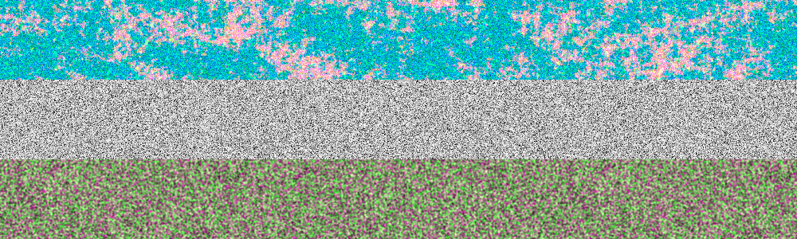

## Introduction to noise and randomness

### A brief parenthesis...

In this reading we will enter in the world of randomness
and noise.
We will start with elementary function and will go trough more complex concept
trough the powerful `Sverchok` nodes.
Randomness and noise are everywhere. We encounter these concepts during everyday life.
We try to make order against chaos but paradoxaly chaos is needed in many natural processes. Many scientists, engineers, visual artists face up this aspect everyday.
As creative minds we can't miss to enter deeply into the world of randomness and noise.

But what is chaos, what randomness?

In the next sections i will explain it... with some nodes.
All examples will be provided with a json file to experiment what will be discussed.
___

###### Index

- [randomness](noise_part1.md)
- [noise](noise_part2.md)
- noise and fractals
- references
