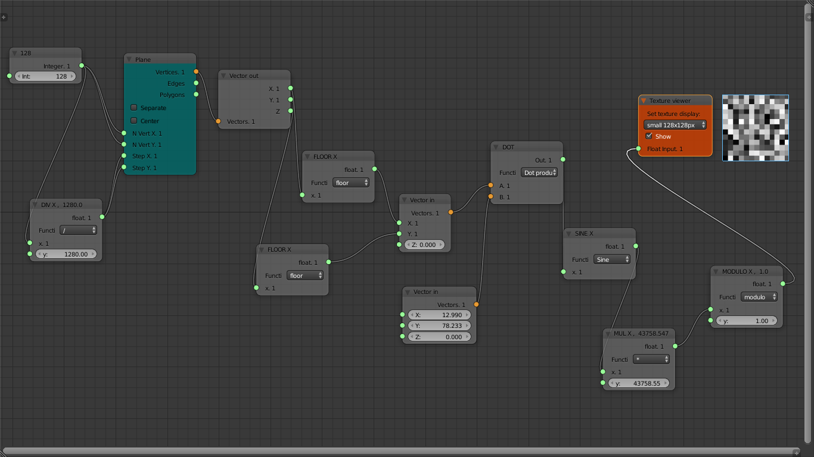

## Randomness

.png)

We start with a simple sine function, and we will continue  adding more and more complexity.
In Sverchok is pretty simple just few nodes and you can display a sine function.

[sine json][ffbdb430]

  [ffbdb430]: ../../json/line_with_sine.json "sine"

We can achieve randomness, modulating, distorting and increasing the frequency and amplitude of the sinusoidal curve. In synthesis adding a
kind of disorder to this ordered shape. But let's make a step in between the full randomness. What's happens if we plug the sine function into a fractional?

.png)

We obtain a curve with pikes and vertical jumps, but still quite ordered. How we can get
this in Sverchok? This is yet quite simple see the picture below:

[fractional sine][00fd57b5]

  [00fd57b5]: ../../json/tutorial_noise/fractional_sin_function.json "fractional sine"

In Sverchok we use the modulo function from the `Math node` in order to achieve
the fractional(Glsl) that is a sawtooth curve:

[fractional][c06d34cc]

  [c06d34cc]: ../../json/tutorial_noise/line_with_fractional.json "fractional (with modulo)"

As said before, we modulate the curve to obtain more chaos. Try to multiply
the frequency by:

> 10.000

Suddenly the ordered shape lose is clarity
and emphasis.

[fractional sine multiplyed by 10.000][99fd78e2]

  [99fd78e2]: ../../json/tutorial_noise/fractional_sin_function_x_10000.json "fractional sine multiplyed by 10.000"

We can go further in this direction, let's add to this function more 'noise'.
Let's take the **x** and **y** vector component of the line and we perform a **dot** product with:

> **x** = `12.9898`
>
> **y** = `78.233`

before the sinusoidal function, and we increase the frequency to a considerable value, let's say to:

> **freq** = `43758.5453123`

Finally we can observ a random curve:

[fractional sin random][244ee782]

  [244ee782]: ../../json/noise_tutorial/fractional_sin_random_function.json "fractional sin random"
What we can do with a random function? For example something like this:

[random checkerboard][642d5f2a]

  [642d5f2a]: ../../json/noise_tutorial/random_w_floor_checkerboard..json "random checkerboard (with floor)"

In the next chapter we will develop these tree nodes in something visually more interesting.
We will talk about noise.
