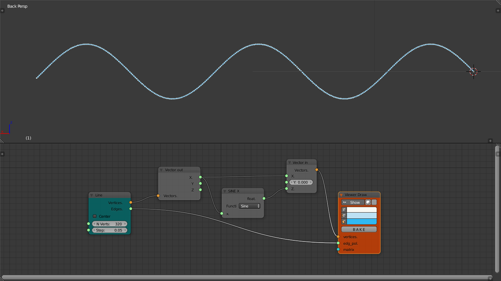
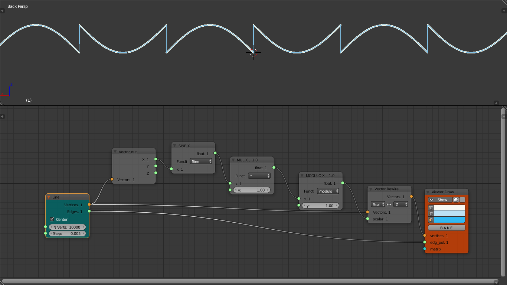
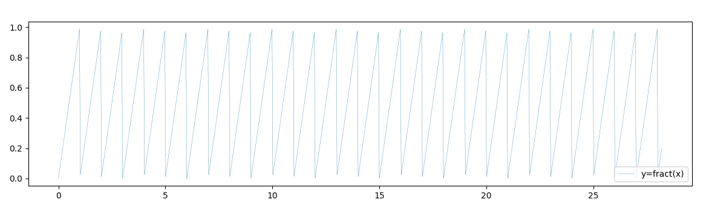
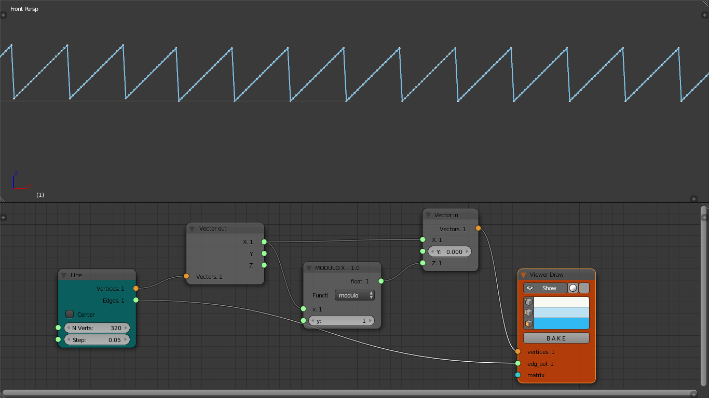
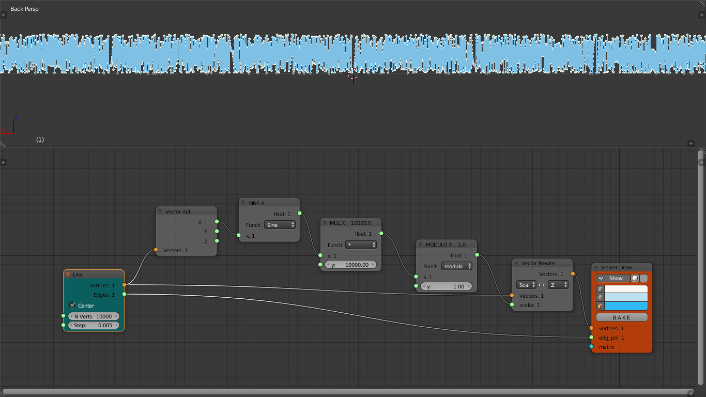
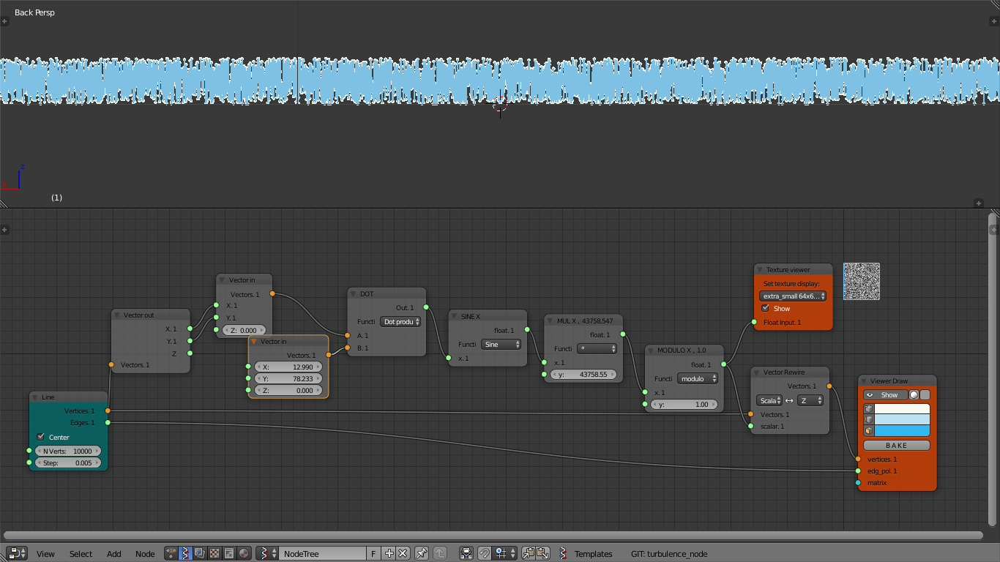

# Randomness

.png)

We start with a simple sine function, and we will continue  adding more and more complexity.
In Sverchok is pretty simple just few nodes and you can display a sine function.

We can achieve randomness, modulating, distorting and increasing the frequency and amplitude of the sinusoidal curve. In sinthesis adding a
kind of disorder to this ordered shape. But let's make a step in between the full randomness. What's happens if we plug the sine function into a fractional?

.png)

We obtain a curve with pikes and vertical jumps, but still quite ordered. How we can get
this in Sverchok? This is yet quite simple see the picture below:

In Sverchok we use the modulo function from the `Math node` in order to achieve
the fractional(Glsl) that is a sawtooth curve:

As said before we modulate the curve to obtain more chaos. Try to multiply
the amplitude with a 10000 factor. Suddenly the ordered shape lose is clarity
and emphasis.

We can go further in this direction, let's add to this function more 'noise'.
Let's take the **x** and **y** vector component of the line and we perform a dot product
with `x = 12.9898` and `y = 78.233`
before the sinusoidal function, and we increase the amplitude to a considerable value, let's say to `43758.5453123`.
Finally we can observ a random curve:

In the next chapter we will develop this tree nodes in something more visually interesting.
We will talk about noise.
