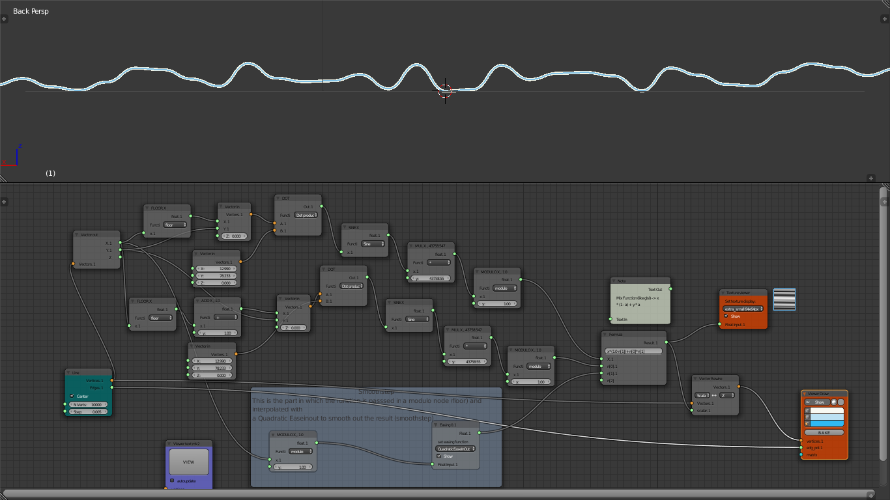

## Noise

We start from the last series of nodes. We are arrived to make a random curve. Probably you know that doesn't exist truly randomness, we not go deeper this aspect too far because goes beyond our goals. We just note that there are different implementations, if you want goes at the end of the tutorial you will find some information source. Let's back instead to Sverchok nodes, this was the random function:


Interpreted as an image can be something like this:


This is also called "white noise", something that is omogeneous and pretty boring
from a visual aspect. We have to go a step further. In the 80's Ken Perlin developed
his well known Perlin algorithm for the film Tron. We do not recreate the same algorithm, but something closer to it.
We will approach to it taking small steps. The first, is to transform the random function above, expressed by a irregular curve in a stepped one. with an only one more node: just connect a floor from a
`Math` node between the **x** vector component, see the image below:


[random plus floor][71d488ed]

  [71d488ed]: ../../json/noise_tutorial/fractional_sin_random_function_plus_floor.json "random plus floor"

Well, you will say: What deal this with the randomness? This is an important step: We modulate that function in something less dramatic, adding more complexity. We create a second branch from the **x** Vector component with a more node, a `Math` add node, the result of the two branch and another x modulo is the modulo factor for the **mix** function of the two branch. Take a look at the picture:


[random with mix][dc9d565d]

  [dc9d565d]: ../../json/noise_tutorial/fractional_sin_random_function_mix_norm.json "random with mix function, without smoothstep"

the **mix** function used in the `formula` node:

```python
  x * (1 - a) + y * a
```

As a final step we add a smoothstep function and we will get a 1(one) dimensional Noise:


[noise 1D][31b16e60]

  [31b16e60]: ../../json/noise_tutorial/fractional_sin_random_function_mix_smoothstep.json "noise 1D"

Surprisingly we have a curve that looks like the profile of a mountain and a natural landscape. But we started instead from a chaotic shape... this is one of the most interesting and fascinating aspects of noise creation.
